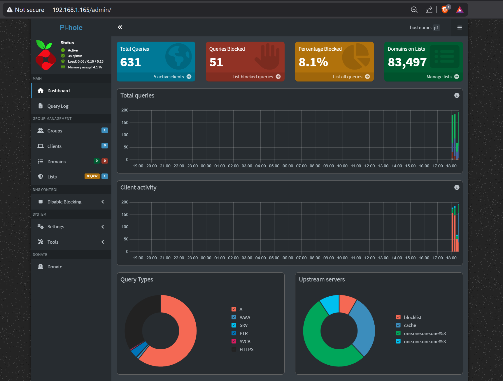
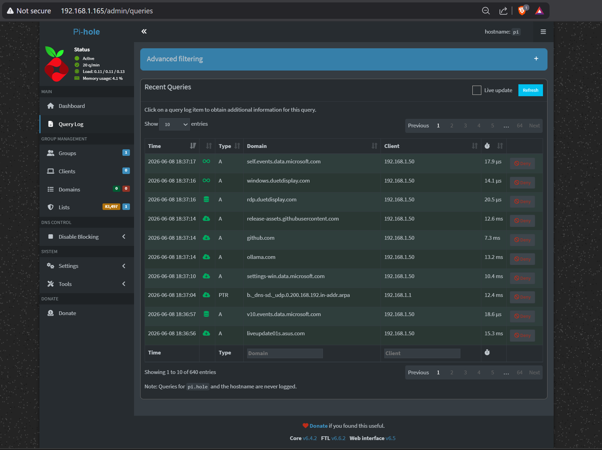
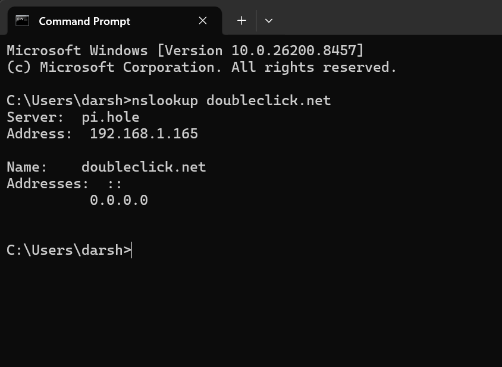

# 01 - Pi-hole DNS Sinkhole

## Project Status

✅ Completed

## Project Summary

This project documents my first completed cybersecurity home lab build: a Pi-hole DNS sinkhole running on a Raspberry Pi 5.

The goal was to create a network-wide DNS filtering system for my home network, where all devices send DNS requests through the Raspberry Pi instead of using the default router or ISP DNS settings. This allows the Pi-hole to block ads, trackers, telemetry, and unwanted domains before the traffic reaches any device.

This project became more than just a basic Pi-hole install because my Verizon CR1000A router would not properly advertise custom DNS settings to client devices. To work around that, I configured Pi-hole to also run as the DHCP server for the network, replacing the router’s DHCP function.

This gave me hands-on practice with DNS, DHCP, Linux, SSH, static IP configuration, router troubleshooting, and real home network problem solving.

---

## Lab Environment

| Component             | Details                                |
| --------------------- | -------------------------------------- |
| Hardware              | Raspberry Pi 5                         |
| Operating System      | Raspberry Pi OS 64-bit based on Debian |
| Router                | Verizon CR1000A                        |
| Management Device     | Windows laptop                         |
| Pi-hole Core          | v6.4.2                                 |
| Pi-hole FTL           | v6.6.2                                 |
| Pi-hole Web Interface | v6.5                                   |
| Upstream DNS          | Cloudflare `1.1.1.1` with DNSSEC       |
| Blocklist Size        | 83,497 domains                         |
| Active Clients        | 5 devices                              |
| Blocking Rate         | Around 8% to 45% of DNS traffic        |
| Pi Static IP          | `192.168.1.165`                        |
| Remote Access         | SSH from Windows laptop                |

---

## Project Goal

The main goal of this project was to build a working DNS sinkhole inside my home network using a Raspberry Pi 5.

The project needed to:

* Filter DNS traffic for the whole home network
* Block known ad, tracker, and unwanted domains
* Route all home devices through Pi-hole
* Use Cloudflare as the upstream DNS provider
* Keep the Raspberry Pi on a static IP address
* Replace the router’s DHCP service because the router would not advertise custom DNS
* Prove that blocking works using command-line testing
* Document the problems and fixes like a real troubleshooting report

This was not just a “copy and paste install.” I had to troubleshoot SSH, usernames, router settings, static IP configuration, DHCP handoff, and client device routing.

---

## Network Architecture

Final working setup:

```text
                         Internet
                            |
                            v
                Verizon CR1000A Router
              Router DHCP: Disabled
              Custom DNS: Not usable
                            |
                            v
        Raspberry Pi 5 - 192.168.1.165
        Pi-hole DNS + Pi-hole DHCP Server
        Upstream DNS: Cloudflare 1.1.1.1
                            |
          -------------------------------------
          |           |           |           |
          v           v           v           v
   Windows Laptop   Phone     Smart TV    Other Devices
      Client 1     Client 2   Client 3     Clients 4-5
```

### How DNS Works in This Setup

```text
Home Device
   |
   | DNS request
   v
Pi-hole on Raspberry Pi 5
   |
   | If domain is blocked:
   | returns 0.0.0.0
   |
   | If domain is allowed:
   v
Cloudflare DNS 1.1.1.1
   |
   v
Internet
```

### How DHCP Works in This Setup

```text
Home Device joins network
   |
   | Requests IP address
   v
Pi-hole DHCP Server
   |
   | Gives device:
   | - IP address
   | - Gateway
   | - DNS server = Raspberry Pi
   v
Device now uses Pi-hole automatically
```

---

## Why Pi-hole Is Also Running DHCP

Originally, I wanted the Verizon CR1000A router to keep handling DHCP while simply pointing all devices to Pi-hole for DNS.

That did not work properly.

The router did not give me reliable control over custom DNS settings for client devices. Even after changing settings, devices were still not consistently using Pi-hole for DNS.

The workaround was to:

1. Enable DHCP inside Pi-hole
2. Disable DHCP on the Verizon CR1000A router
3. Let Pi-hole hand out IP addresses and DNS settings

This solved the problem because every device now receives the Raspberry Pi as its DNS server automatically.

---

## Setup Steps

### 1. Enabled SSH on Raspberry Pi OS

SSH was needed so I could manage the Raspberry Pi from my Windows laptop instead of connecting a monitor and keyboard every time.

On newer Raspberry Pi OS installs, SSH is disabled by default for security reasons.

I enabled SSH during the Raspberry Pi OS setup process.

After the Pi booted, I confirmed SSH access from my Windows laptop.

---

### 2. Connected from Windows Laptop Using SSH

From Windows PowerShell, I connected to the Raspberry Pi using:

```powershell
ssh username@192.168.1.165
```

At first, I tried using the default `pi` username, but that did not work.

New Raspberry Pi OS versions no longer create the default `pi` user automatically. The username is whatever was created during the OS setup.

After using the correct username, SSH worked.

---

### 3. Updated Raspberry Pi OS

Before installing Pi-hole, I updated the system packages.

```bash
sudo apt update
sudo apt full-upgrade -y
```

Then I rebooted the Pi:

```bash
sudo reboot
```

This made sure the system was updated before installing Pi-hole.

---

### 4. Installed Pi-hole

I installed Pi-hole using the official curl installer:

```bash
curl -sSL https://install.pi-hole.net | bash
```

During the installer, I selected:

* Interface: Ethernet/Wi-Fi interface used by the Pi
* Upstream DNS: Cloudflare
* Blocklists: Default Pi-hole blocklist
* Web admin interface: Enabled
* Query logging: Enabled

After installation, I opened the Pi-hole web dashboard from my browser.

```text
http://192.168.1.165/admin
```

---

### 5. Configured Cloudflare as Upstream DNS

I configured Pi-hole to use Cloudflare as the upstream DNS provider.

Cloudflare DNS:

```text
1.1.1.1
1.0.0.1
```

DNSSEC was enabled.

This means allowed DNS requests are forwarded from Pi-hole to Cloudflare after Pi-hole checks whether the domain should be blocked.

---

### 6. Set Static IP Address

The Raspberry Pi needed a static IP because DNS and DHCP services should not move around the network.

The static IP used:

```text
192.168.1.165
```

I configured the static IP using `dhcpcd.conf`.

```bash
sudo nano /etc/dhcpcd.conf
```

Example configuration:

```bash
interface wlan0
static ip_address=192.168.1.165/24
static routers=192.168.1.1
static domain_name_servers=192.168.1.165 1.1.1.1
```

After saving the file, I restarted networking/rebooted the Pi:

```bash
sudo reboot
```

Then I verified the IP address:

```bash
hostname -I
```

Expected result:

```text
192.168.1.165
```

---

### 7. Found the Verizon CR1000A DNS Limitation

The original plan was:

```text
Router DHCP enabled
Router gives devices Pi-hole DNS
Pi-hole filters DNS traffic
```

But the Verizon CR1000A router would not properly advertise the custom DNS server to all devices.

This meant some devices were still bypassing Pi-hole and using router/ISP DNS instead.

This was one of the biggest troubleshooting points in the project.

---

### 8. Enabled Pi-hole DHCP Server

To fix the router DNS issue, I enabled Pi-hole’s DHCP server.

In the Pi-hole web dashboard:

```text
Settings > DHCP
```

I enabled DHCP and configured a DHCP range.

Example:

```text
Range start: 192.168.1.100
Range end:   192.168.1.250
Router:      192.168.1.1
```

This allowed Pi-hole to hand out IP addresses and automatically tell devices to use Pi-hole for DNS.

---

### 9. Disabled DHCP on Verizon CR1000A Router

After enabling DHCP on Pi-hole, I disabled DHCP on the Verizon CR1000A router.

This step is important because two DHCP servers on the same network can cause IP conflicts and random network issues.

Final DHCP setup:

```text
Verizon CR1000A DHCP: Disabled
Pi-hole DHCP: Enabled
```

---

### 10. Renewed Client Network Connections

After switching DHCP from the router to Pi-hole, I had to make sure devices received new network leases.

On some devices, I disconnected and reconnected Wi-Fi.

On Windows, I used:

```powershell
ipconfig /release
ipconfig /renew
```

Then I checked the DNS server:

```powershell
ipconfig /all
```

The device should show the Raspberry Pi as the DNS server.

---

### 11. Verified 5 Active Clients

Inside the Pi-hole dashboard, I confirmed that 5 home devices were active clients on the network.

This showed that devices were actually using Pi-hole and not bypassing it.

The dashboard also showed:

```text
Domains on blocklist: 83,497
Blocking rate: around 8% to 45%
Active clients: 5
```

The blocking rate changes depending on which devices are active and what apps/websites are being used.

---

### 12. Confirmed Blocking with nslookup

To prove that Pi-hole was actually blocking domains, I tested a known ad/tracking domain.

From Windows PowerShell:

```powershell
nslookup doubleclick.net
```

Expected result:

```text
Address: 0.0.0.0
```

This confirmed that Pi-hole was sinkholing the domain instead of resolving it normally.

---

## Screenshots

Add screenshots inside the `screenshots/` folder.

```text
01-pihole-dns-sinkhole/
├── README.md
└── screenshots/
    ├── dashboard-overview.png
    ├── query-log.png
    └── nslookup-proof.png
```

### Dashboard Overview

Shows Pi-hole status, active clients, blocked queries, and blocklist count.





### Query Log

Shows live DNS requests from devices on the home network.





### nslookup Proof

Shows `doubleclick.net` returning `0.0.0.0`.





---

## Challenges and Fixes

This was the most important part of the project because the setup did not work perfectly the first time.

### Challenge 1: The Default `pi` User Did Not Exist

#### Problem

A lot of tutorials online still use this command:

```bash
ssh pi@raspberrypi.local
```

or:

```bash
ssh pi@<ip-address>
```

That did not work for me because newer Raspberry Pi OS installs do not create the default `pi` user automatically.

#### Fix

I used the username I created during Raspberry Pi OS setup.

Correct format:

```bash
ssh myusername@192.168.1.165
```

#### What I Learned

I learned that tutorials can be outdated, and I should understand what each command is doing instead of blindly copying it.

---

### Challenge 2: SSH Was Disabled by Default

#### Problem

At first, I could not SSH into the Raspberry Pi because SSH was not enabled.

This made it look like the Pi was unreachable, but the actual issue was that the SSH service was not accepting connections.

#### Fix

I enabled SSH through Raspberry Pi OS setup.

After that, I connected from my Windows laptop using PowerShell.

#### What I Learned

I learned that remote management has to be enabled before trying to troubleshoot network issues. I also learned the difference between a device being offline and a service simply not running.

---

### Challenge 3: Verizon CR1000A Would Not Advertise Custom DNS Properly

#### Problem

The biggest issue was the Verizon CR1000A router.

I wanted the router to keep doing DHCP and simply tell devices to use Pi-hole as DNS.

That did not work reliably. Devices were not consistently using the Raspberry Pi for DNS, which meant some traffic bypassed Pi-hole.

#### Fix

I moved DHCP from the Verizon router to Pi-hole.

Final setup:

```text
Router DHCP: Disabled
Pi-hole DHCP: Enabled
```

Once Pi-hole controlled DHCP, it could give every device the correct DNS server.

#### What I Learned

I learned that DNS filtering only works if devices are actually using the Pi-hole DNS server. I also learned how DHCP and DNS work together in a real network.

---

### Challenge 4: Raspberry Pi Lost Network Access During DHCP Switchover

#### Problem

During the DHCP changeover, the Raspberry Pi temporarily lost network connectivity.

This happened because I was changing which device controlled IP address assignment on the network.

If the Pi does not have a reliable IP during that process, it can disappear from the network.

#### Fix

I set a static IP address in `dhcpcd.conf`.

Static IP used:

```text
192.168.1.165
```

Then I rebooted and confirmed the Pi was reachable again.

```bash
hostname -I
```

#### What I Learned

I learned why infrastructure devices need static IP addresses. A DNS/DHCP server cannot be changing IP addresses randomly because the rest of the network depends on it.

---

### Challenge 5: Devices Needed New DHCP Leases

#### Problem

After switching DHCP to Pi-hole, some devices still had old network leases from the router.

This meant they did not immediately show up correctly in Pi-hole.

#### Fix

I renewed the network connection on devices.

On Windows:

```powershell
ipconfig /release
ipconfig /renew
```

For phones and TVs, I disconnected and reconnected Wi-Fi.

#### What I Learned

I learned that DHCP changes are not always instant. Client devices may keep old leases until they renew or reconnect.

---

### Challenge 6: Had to Troubleshoot Multiple Layers

#### Problem

When something failed, it was not always obvious whether the issue was:

* Raspberry Pi OS
* SSH
* Pi-hole
* Router settings
* DHCP
* DNS
* Client device cache
* Wi-Fi reconnect issue

#### Fix

I broke the troubleshooting into smaller checks:

```bash
hostname -I
```

```bash
pihole status
```

```bash
pihole -t
```

```powershell
ipconfig /all
```

```powershell
nslookup doubleclick.net
```

Instead of guessing, I checked one layer at a time.

#### What I Learned

I learned that troubleshooting is a real skill. The best method is to test one thing at a time and prove where the problem is.

---

## Final Working Results

Current working status:

| Item                    | Result            |
| ----------------------- | ----------------- |
| Pi-hole Running         | Yes               |
| Web Dashboard Working   | Yes               |
| DNS Filtering Working   | Yes               |
| DHCP Running on Pi-hole | Yes               |
| Router DHCP Disabled    | Yes               |
| Active Clients          | 5                 |
| Static IP Working       | Yes               |
| Cloudflare Upstream DNS | Yes               |
| DNSSEC Enabled          | Yes               |
| Blocklist Domains       | 83,497            |
| Blocking Rate           | Around 8% to 45%  |
| `doubleclick.net` Test  | Returns `0.0.0.0` |

---

## Commands Reference

### System Update

```bash
sudo apt update
sudo apt full-upgrade -y
```

### Reboot Raspberry Pi

```bash
sudo reboot
```

### Check Raspberry Pi IP Address

```bash
hostname -I
```

### Edit Static IP Configuration

```bash
sudo nano /etc/dhcpcd.conf
```

### Install Pi-hole

```bash
curl -sSL https://install.pi-hole.net | bash
```

### Check Pi-hole Status

```bash
pihole status
```

### View Live DNS Queries

```bash
pihole -t
```

### Update Gravity / Blocklists

```bash
pihole -g
```

### Restart Pi-hole DNS

```bash
pihole restartdns
```

### Change Pi-hole Admin Password

```bash
pihole setpassword
```

### Check Pi-hole Version

```bash
pihole -v
```

### Repair Pi-hole Installation

```bash
pihole -r
```

### Flush Pi-hole Logs

```bash
pihole flush
```

### Windows: Release IP Lease

```powershell
ipconfig /release
```

### Windows: Renew IP Lease

```powershell
ipconfig /renew
```

### Windows: Check Network Details

```powershell
ipconfig /all
```

### Windows: Test Blocked Domain

```powershell
nslookup doubleclick.net
```

Expected blocked result:

```text
Address: 0.0.0.0
```

---

## What I Learned

This project helped me understand several important networking and cybersecurity concepts.

### DNS

I learned how devices use DNS to turn domain names into IP addresses. I also learned how DNS filtering works by blocking unwanted domains before they resolve.

### DHCP

I learned how DHCP gives devices IP addresses, gateway information, and DNS server information. This became very important when I had to move DHCP from my Verizon router to Pi-hole.

### SSH

I learned how to remotely manage a Linux device from a Windows laptop using SSH.

### Linux

I practiced basic Linux administration, including updating packages, editing configuration files, checking services, and rebooting safely.

### Static IP Addresses

I learned why servers and infrastructure devices need static IP addresses. If the DNS server changes IP addresses, the network can break.

### Router Limitations

I learned that ISP routers do not always give full control. Sometimes the best solution is to work around those limitations safely.

### Troubleshooting

The biggest lesson was troubleshooting. I had to test SSH, IP addresses, DHCP leases, DNS resolution, and client settings before everything worked correctly.

---

## Skills Demonstrated

This project demonstrates the following skills for a cybersecurity or networking portfolio:

* Raspberry Pi server setup
* Linux command line usage
* SSH remote administration
* DNS configuration
* DHCP server configuration
* Static IP configuration
* Home router troubleshooting
* Network-wide ad and tracker blocking
* DNS sinkhole deployment
* Client network testing
* Windows networking commands
* Technical documentation
* Troubleshooting and problem solving

---

## Resume/Portfolio Value

This project shows that I can do more than follow a tutorial.

I configured a real device on a real home network, ran into real router limitations, and solved the problem by changing the network design.

Important real-world skills shown in this project:

* Understanding how DNS and DHCP work together
* Troubleshooting network connectivity issues
* Documenting technical problems clearly
* Using Linux as a network service host
* Validating results with command-line tools
* Building a working security lab from basic hardware

---

## Next Steps

Planned improvements:

* Add more curated blocklists
* Create local DNS records for home lab services
* Add screenshots to this README
* Export Pi-hole query data for analysis
* Monitor top blocked domains
* Add WireGuard VPN access to manage the lab remotely
* Use Pi-hole logs later inside a SIEM project
* Compare DNS traffic before and after adding more devices
* Document common blocked domains and false positives

---

## Security Notes

This project is running inside my own home network for learning purposes.

I am not using this to monitor other people’s networks or bypass security controls. The purpose is to understand DNS, DHCP, and network filtering in a controlled lab environment.

---

## Conclusion

This Pi-hole project was my first real cybersecurity home lab project on the Raspberry Pi 5.

It started as a simple DNS sinkhole install, but became a much better learning experience because of the problems I had to solve with SSH, static IP configuration, router limitations, DHCP migration, and DNS testing.

The final result is a working network-wide DNS filtering system where all home devices route through Pi-hole, and blocked domains like `doubleclick.net` return `0.0.0.0`.

This project gave me a strong foundation for the next home lab projects, including WireGuard VPN, Cowrie honeypot, Suricata IDS, ELK SIEM, Active Directory, and Zeek network monitoring.
