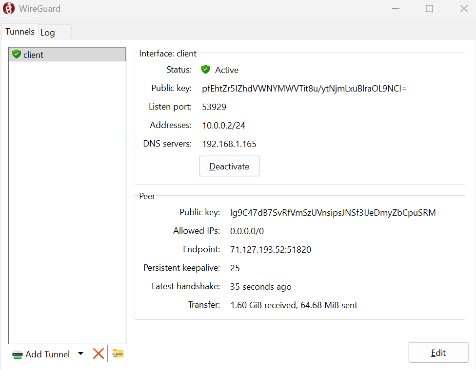
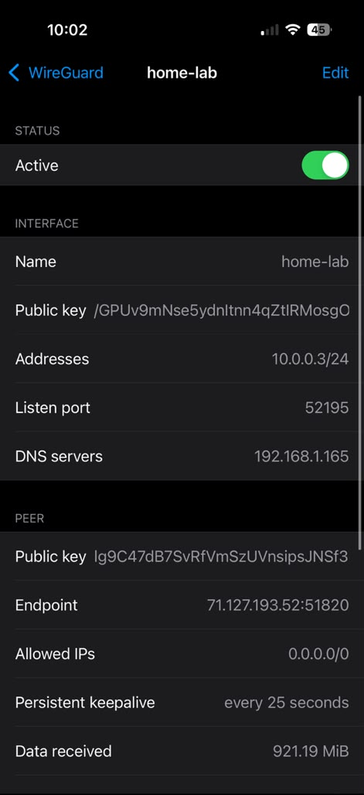
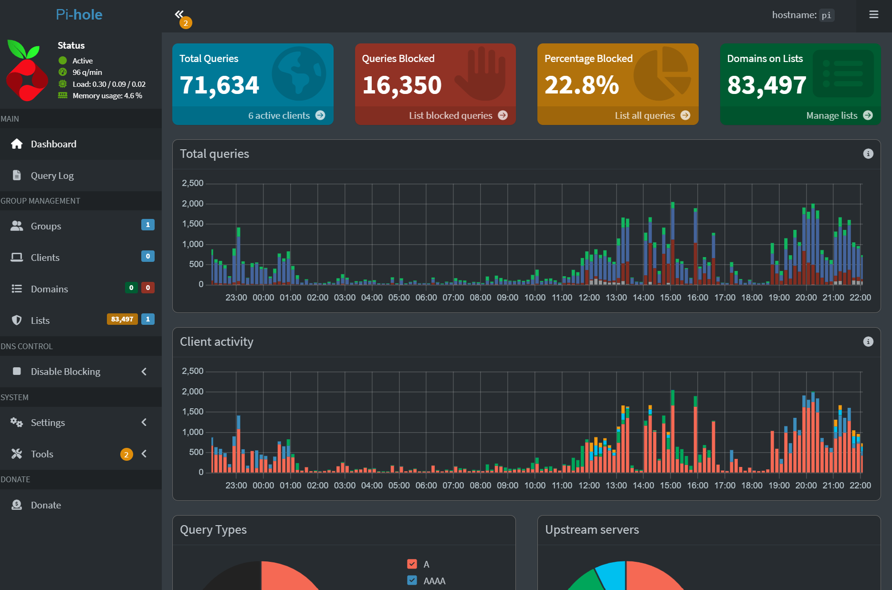
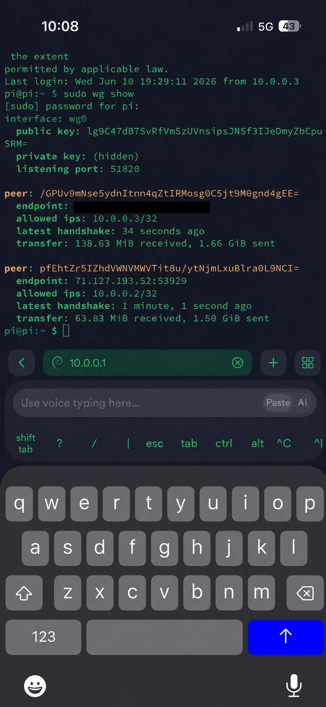

# 02 - WireGuard VPN Server

## Project Status

✅ Completed

## Project Summary

This project documents the deployment of a self-hosted WireGuard VPN server running on a Raspberry Pi 5 as part of my cybersecurity home lab.

The goal was to create a secure method of remotely accessing my home network while learning how modern VPNs work, including public/private key cryptography, encrypted tunnels, port forwarding, Linux networking, and remote administration.

The VPN allows me to securely connect back to my home network from anywhere using either my Windows laptop or iPhone. Once connected, all traffic is routed through the VPN tunnel and uses my Pi-hole DNS server for filtering.

The completed solution provides secure remote access to the home network using WireGuard while integrating Pi-hole DNS filtering and encrypted client connectivity.

---

# Lab Environment

| Component           | Details                         |
| ------------------- | ------------------------------- |
| Hardware            | Raspberry Pi 5                  |
| Operating System    | Raspberry Pi OS 64-bit (Debian) |
| WireGuard Version   | 1.0.20210914                    |
| Router              | Verizon CR1000A                 |
| Server LAN IP       | 192.168.1.165                   |
| VPN Tunnel Network  | 10.0.0.0/24                     |
| WireGuard Server IP | 10.0.0.1                        |
| Listen Port         | UDP 51820                       |
| VPN DNS Server      | Pi-hole (192.168.1.165)         |
| Routing Mode        | Full Tunnel                     |
| Windows Client IP   | 10.0.0.2                        |
| iPhone Client IP    | 10.0.0.3                        |
| Public IP           | Redacted                        |
| Remote Access       | WireGuard VPN                   |

---

# Project Goal

The objectives of this project were:

* Build a self-hosted VPN server
* Securely access my home network remotely
* Learn WireGuard configuration and key management
* Understand VPN tunneling concepts
* Route DNS traffic through Pi-hole
* Configure router port forwarding
* Use encrypted communication over public networks
* Practice Linux networking and troubleshooting
* Create reusable documentation

---

# Network Architecture

Final working design:

```text
                    Internet
                        |
                        |
                Public IP Address
                        |
                        |
                 UDP Port 51820
                        |
                        |
               Verizon CR1000A Router
                        |
                        |
                 192.168.1.165
               Raspberry Pi 5
                 WireGuard VPN
                        |
                        |
         -------------------------------
         |                             |
         |                             |
         v                             v
      Pi-hole                    Home Network
   DNS Filtering               Internal Devices
         |
         |
         v
   DNS Responses
```

Remote client flow:

```text
Laptop / iPhone
        |
Encrypted Tunnel
        |
Internet
        |
UDP 51820
        |
WireGuard Server
10.0.0.1
        |
Pi-hole DNS
192.168.1.165
        |
Home Network Resources
```

---

# What WireGuard Does

WireGuard creates an encrypted tunnel between a remote device and my home network.

Instead of exposing services like SSH directly to the internet, I connect to WireGuard first.

Once connected:

```text
Laptop → WireGuard Tunnel → Home Network
```

or

```text
Phone → WireGuard Tunnel → Home Network
```

This allows me to:

* SSH into Raspberry Pi
* Access Pi-hole dashboard
* Use Pi-hole DNS filtering remotely
* Secure traffic on public Wi-Fi
* Access future home lab services

---

# Key Management

One of the biggest concepts I learned was how WireGuard uses public/private key cryptography.

Every device gets:

```text
Private Key
Public Key
```

### Server

```text
Server Private Key
Server Public Key
```

### Windows Laptop

```text
Laptop Private Key
Laptop Public Key
```

### iPhone

```text
Phone Private Key
Phone Public Key
```

Important:

* Private keys never leave the device
* Public keys can be shared
* WireGuard peers identify each other using public keys
* If a private key leaks, regenerate the keypair immediately

Think of it like:

```text
Public Key  = username
Private Key = password
```

except much stronger cryptographically.

---

# Installation and Configuration

## Step 1 - Update Raspberry Pi

```bash
sudo apt update
sudo apt full-upgrade -y
```

Reboot:

```bash
sudo reboot
```

---

## Step 2 - Install WireGuard

Install WireGuard and networking tools.

```bash
sudo apt install wireguard iptables qrencode -y
```

Packages installed:

* wireguard
* wireguard-tools
* iptables
* qrencode

---

## Step 3 - Generate Server Keys

Create WireGuard key directory:

```bash
sudo mkdir /etc/wireguard
cd /etc/wireguard
```

Generate server keys:

```bash
sudo wg genkey | sudo tee server_private.key | wg pubkey | sudo tee server_public.key
```

View public key:

```bash
sudo cat server_public.key
```

---

## Step 4 - Generate Laptop Keys

```bash
sudo wg genkey | sudo tee laptop_private.key | wg pubkey | sudo tee laptop_public.key
```

---

## Step 5 - Generate Phone Keys

```bash
sudo wg genkey | sudo tee phone_private.key | wg pubkey | sudo tee phone_public.key
```

---

# Enable IP Forwarding

WireGuard must be able to forward packets between networks.

I discovered the traditional:

```bash
/etc/sysctl.conf
```

file did not exist on my system.

Instead I used:

```bash
sudo nano /etc/sysctl.d/99-wireguard.conf
```

Add:

```text
net.ipv4.ip_forward=1
```

Apply:

```bash
sudo sysctl --system
```

Verify:

```bash
sysctl net.ipv4.ip_forward
```

Expected:

```text
net.ipv4.ip_forward = 1
```

---

# Configure WireGuard Server

Create:

```bash
sudo nano /etc/wireguard/wg0.conf
```

Example:

```ini
[Interface]
Address = 10.0.0.1/24
ListenPort = 51820
PrivateKey = SERVER_PRIVATE_KEY

PostUp = iptables -A FORWARD -i wg0 -j ACCEPT
PostUp = iptables -A FORWARD -o wg0 -j ACCEPT
PostUp = iptables -t nat -A POSTROUTING -o wlan0 -j MASQUERADE

PostDown = iptables -D FORWARD -i wg0 -j ACCEPT
PostDown = iptables -D FORWARD -o wg0 -j ACCEPT
PostDown = iptables -t nat -D POSTROUTING -o wlan0 -j MASQUERADE

[Peer]
PublicKey = LAPTOP_PUBLIC_KEY
AllowedIPs = 10.0.0.2/32

[Peer]
PublicKey = PHONE_PUBLIC_KEY
AllowedIPs = 10.0.0.3/32
```

---

# Configure Windows Client

Create:

```ini
[Interface]
PrivateKey = LAPTOP_PRIVATE_KEY
Address = 10.0.0.2/24
DNS = 192.168.1.165

[Peer]
PublicKey = SERVER_PUBLIC_KEY
Endpoint = PUBLIC_IP:51820
AllowedIPs = 0.0.0.0/0
PersistentKeepalive = 25
```

Import into WireGuard Windows application.

---

# Configure iPhone Client

Create:

```ini
[Interface]
PrivateKey = PHONE_PRIVATE_KEY
Address = 10.0.0.3/24
DNS = 192.168.1.165

[Peer]
PublicKey = SERVER_PUBLIC_KEY
Endpoint = PUBLIC_IP:51820
AllowedIPs = 0.0.0.0/0
PersistentKeepalive = 25
```

Generate QR code:

```bash
qrencode -t ansiutf8 < iphone.conf
```

Scan with WireGuard iOS app.

---

# Configure Verizon Router

Create a UDP port forward.

```text
Protocol: UDP
Port: 51820
Destination IP: 192.168.1.165
```

This forwards incoming VPN traffic to the Raspberry Pi.

---

# Start WireGuard

Enable service:

```bash
sudo systemctl enable wg-quick@wg0
```

Start service:

```bash
sudo systemctl start wg-quick@wg0
```

Verify:

```bash
sudo systemctl status wg-quick@wg0
```

---

# Verify VPN Operation

Check active tunnel:

```bash
sudo wg show
```

Expected:

```text
peer:
latest handshake:
transfer:
```

Handshakes should appear after client connection.

---

# Verify Pi-hole Through VPN

Connect from phone or laptop.

Check:

```bash
nslookup google.com
```

DNS server should show:

```text
192.168.1.165
```

This confirms VPN traffic uses Pi-hole.

---

# SSH Through VPN

Once connected:

```bash
ssh username@10.0.0.1
```

This allows management of the Raspberry Pi through the encrypted tunnel.

---

# Screenshots

Store screenshots here:

```text
02-wireguard-vpn-server/
├── README.md
├── wireguard-windows-connected.png
├── wireguard-iphone-connected.png
├── pihole-vpn-clients.png
└── wg-show-output.png
```

### Windows Connection



### iPhone Connection



### Pi-hole VPN Clients



### wg show Output



---

# Challenges and Fixes

The following issues were encountered during deployment and the steps used to resolve them.

---

## Challenge 1 - iptables Was Not Installed

### Problem

WireGuard PostUp/PostDown rules failed.

Error messages indicated iptables commands were unavailable.

### Fix

Install manually:

```bash
sudo apt install iptables
```

### What I Learned

Not every networking package is installed by default.

Always verify dependencies.

---

## Challenge 2 - Permission Denied Creating Keys

### Problem

Running:

```bash
wg genkey
```

generated permission errors.

### Fix

Use sudo.

```bash
sudo wg genkey
```

### What I Learned

WireGuard stores sensitive cryptographic material in protected directories.

Linux permissions matter.

---

## Challenge 3 - sysctl.conf Did Not Exist

### Problem

Many tutorials reference:

```bash
/etc/sysctl.conf
```

but it did not exist on my Raspberry Pi OS installation.

### Fix

Used:

```bash
/etc/sysctl.d/99-wireguard.conf
```

instead.

### What I Learned

Modern Linux systems may use modular configuration directories instead of a single file.

---

## Challenge 4 - SSH Disconnects After WireGuard Starts

### Problem

After activating WireGuard:

```bash
sudo systemctl restart wg-quick@wg0
```

my SSH session disconnected.

At first I thought WireGuard broke networking.

### Fix

Reconnect using:

```bash
ssh username@10.0.0.1
```

through the VPN tunnel.

### What I Learned

VPN tunnels change routing behavior.

A dropped SSH session does not automatically mean the service failed.

---

## Challenge 5 - WireGuard Restart Kicks You Out

### Problem

Restarting WireGuard immediately terminates active sessions.

### Fix

Be prepared to reconnect using either:

```bash
192.168.1.165
```

or

```bash
10.0.0.1
```

depending on where you are connected from.

### What I Learned

Always think about how network changes affect active management sessions.

---

## Challenge 6 - Router Port Forwarding Verification

### Problem

Initially no handshake appeared.

```bash
sudo wg show
```

showed no activity.

### Fix

Reviewed Verizon CR1000A port forwarding configuration.

Verified:

```text
UDP
51820
192.168.1.165
```

After correcting configuration, handshakes appeared.

### What I Learned

VPN issues are often firewall or router issues rather than WireGuard issues.

---

# Final Working Results

| Item                    | Status |
| ----------------------- | ------ |
| WireGuard Running       | Yes    |
| Port Forwarding Working | Yes    |
| Laptop Client Connected | Yes    |
| iPhone Client Connected | Yes    |
| Full Tunnel Routing     | Yes    |
| Pi-hole DNS Through VPN | Yes    |
| SSH Through Tunnel      | Yes    |
| Handshakes Verified     | Yes    |
| Encryption Active       | Yes    |

---

# Commands Reference

### Show Status

```bash
sudo wg show
```

### Start WireGuard

```bash
sudo systemctl start wg-quick@wg0
```

### Stop WireGuard

```bash
sudo systemctl stop wg-quick@wg0
```

### Restart WireGuard

```bash
sudo systemctl restart wg-quick@wg0
```

### Enable at Boot

```bash
sudo systemctl enable wg-quick@wg0
```

### Check Service

```bash
sudo systemctl status wg-quick@wg0
```

### Show IP Forwarding

```bash
sysctl net.ipv4.ip_forward
```

### View Configuration

```bash
sudo cat /etc/wireguard/wg0.conf
```

### Generate QR Code

```bash
qrencode -t ansiutf8 < iphone.conf
```

---

# Security Notes

Never share:

* Private keys
* Full WireGuard configs
* Public IP address
* Router login screenshots
* QR codes after deployment

Safe to share:

* Public keys
* Redacted configs
* Tunnel IPs
* Network diagrams

If a private key is exposed:

1. Generate a new keypair
2. Update peer configuration
3. Remove compromised key immediately

---


# Skills Demonstrated

This project demonstrates:

* Linux Administration
* WireGuard Deployment
* VPN Configuration
* Public Key Infrastructure Concepts
* Router Port Forwarding
* DNS Integration
* Pi-hole Integration
* SSH Administration
* Network Troubleshooting
* Technical Documentation
* Remote Access Architecture
* Security Best Practices

---


# Next Steps

Planned improvements:

* Add additional WireGuard clients
* Create client onboarding documentation
* Implement VPN monitoring
* Integrate VPN logs into ELK Stack
* Create VPN access policies
* Add multi-site VPN experiments
* Explore split-tunnel configurations
* Use WireGuard to securely manage future lab services

---

# Conclusion

This WireGuard project transformed my Raspberry Pi from a local DNS server into a secure remote-access gateway.

The final system allows encrypted connections from both my Windows laptop and iPhone, routes all traffic through the VPN tunnel, uses Pi-hole for DNS filtering, and provides secure access to my home lab from anywhere.

The deployment required configuration and validation of routing, port forwarding, key management, Linux networking, DNS integration, and SSH connectivity to achieve a fully operational remote-access solution.
